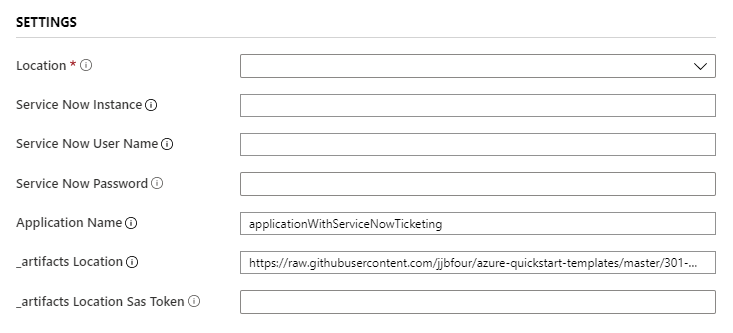
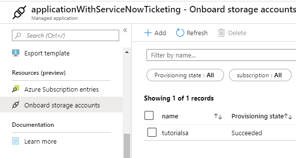

This sample deploys an Azure Managed Application, which uses a custom provider to extend Azure Resource Manager APIs with Service Now. This is an advanced sample and builds off the follow:

* [201 managed application post deployment updates](../201-managed-applications-post-deployment-updates/README.md)
* [201 custom providers creating tickets for deployments](../201-custom-rp-create-ticket-for-deployment/README.md)

## Details on the managed application

The managed application introduces several new Azure Resource Manager REST APIs as well as several custom views.

Azure Resource Manager REST APIs:

1) An extension API called "associations", which allows creating service requests.
2) An custom API called "customTickets", which allows creation, update, and deletion of tickets.

### Associations

If you are unfamiliar with "associations" or custom providers, this sample builds off of the [custom provider existing resource deployment sample](../101-custom-rp-existing-resource-deployments/README.md), which has more information. In this sample, existing resource deployments will be expanded to work with an external service. In this case, the custom provider creates a connection to service now. However, any service or public HTTP endpoint can be used as an extension.

### Starting from scratch

If you don't have an existing custom provider with logic deployed, you can deploy the custom provider infrastructure by providing the service now template parameter information. If you don't have a service now account, you can create a free test account:

The resulting deployment should consist of two parts: the custom provider infrastructure and the association resource. The custom provider infrastructure deploys the web connector to service now, logic app, and custom provider. The association triggers the custom provider to perform an action. In this sample, the action is creating a service now record.

### Existing custom provider

Once the sample is initially deployed, instead of recreating everything from scratch, it can just use an existing custom provider resource. When deploying with an existing custom provider resource, the "Custom Resource Provider Id" and "Association Name" are the only required fields. This will only deploy the "associations" resource.

The outputs section of the template deployment also will display the created resource, which can be accessed through the *reference* template function.

In addition, you can navigate to the deployed Azure Logic App resource in the template resource group and check the *Runs history* tab to see the HTTP calls.

Additional "associations" can be created through deploying another Azure Resource Manager Template or directly interfacing with the Azure REST API.
